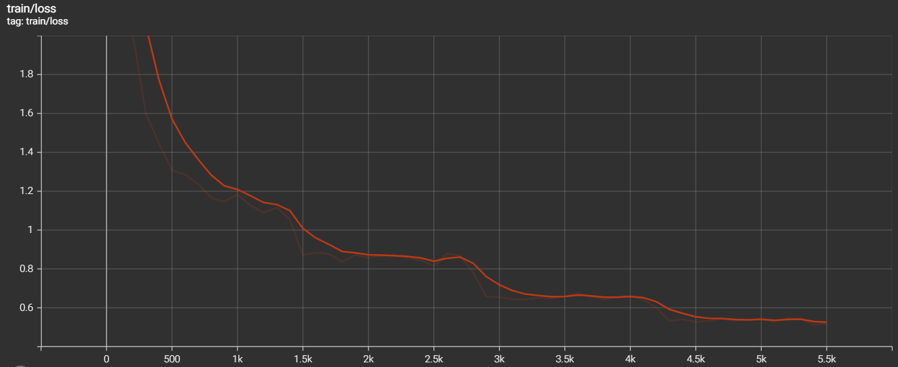

## Overview

This deliverable fine-tunes **BERT-Base** (`bert-base-uncased`), a 12-layer Transformer
encoder with ~110M parameters, on the **SQuAD** dataset (Stanford Question Answering
Dataset) for **extractive question answering**: given a context paragraph and a question,
the model predicts the start and end token positions of the answer span within the
context.

The training script (`run_qa.py`, with helper modules `trainer_qa.py` and `utils_qa.py`)
loads the pretrained BERT-Base checkpoint, replaces its original pretraining head with a
lightweight linear layer for span prediction, tokenizes and splits long contexts into
overlapping windows, and fine-tunes the full model end-to-end on the
SQuAD training split using Hugging Face's `Trainer` API. Training and evaluation metrics
are logged automatically and reported to TensorBoard.

## Baseline implementation

Scripts `run_qa.py`, `trainer_qa.py`, `utils_qa.py` obtained from:
https://github.com/huggingface/transformers/tree/examples/pytorch/question-answering

Downloaded on 2026-09-27. Transformers tag 4.30.2.

## Baseline Training execution — BERT-Base on SQuAD (Full Dataset)

### Configuration

| Parameter | Value |
|---|---|
| Model | bert-base-uncased |
| Dataset | SQuAD (full) |
| GPU | 1× NVIDIA A100 |
| Precision | mixed TF32 / BF16 |
| Batch size (per device) | 64 |
| Num workers| 8 |
| Learning rate | 3e-5 |
| Max sequence length | 384 |
| Doc stride | 128 |

### Results

| Metric | Value |
|---|---|
| Epochs | 4.0 |
| Train loss (final) | 0.8732 |
| Train runtime | 0:25:08.03 |
| Train samples | 88524 |
| Train samples/second | 234.80 |
| Train steps/second | 3.67 |

### Evolution of loss during training

---
